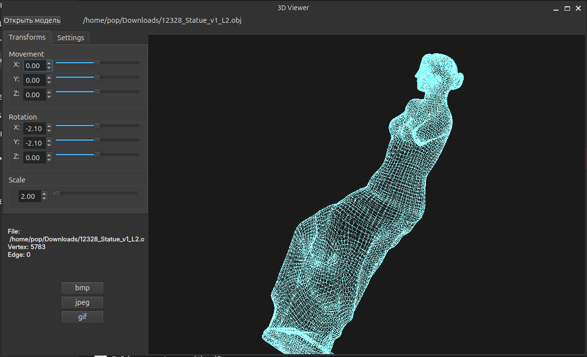

# 3D Viewer

3D-приложение для визуализации каркасных моделей в трехмерном пространстве с поддержкой аффинных преобразований, графического интерфейса и сохранения результатов рендеринга.

Проект реализован на **C++20** с использованием **объектно-ориентированного подхода**, паттерна **MVC** и нескольких шаблонов проектирования.

---

### Загрузка и визуализация
- Загрузка каркасных моделей из файлов формата **.obj**
  - поддержка списков вершин и поверхностей
- Отображение **одной модели** в каждый момент времени
- Отображение информации о модели:
  - имя файла
  - количество вершин
  - количество ребер

### Аффинные преобразования
- Перемещение модели вдоль осей **X / Y / Z**
- Поворот модели вокруг собственных осей **X / Y / Z**
- Масштабирование модели с заданным коэффициентом

### Графический интерфейс
- Выбор файла модели через диалог
- Зона визуализации каркасной модели
- Панели управления трансформациями

---

## 🎨 Дополнительные настройки

- Тип проекции:
  - параллельная
  - центральная
- Настройка отображения:
  - тип линий (сплошные / пунктирные)
  - толщина и цвет ребер
  - отображение вершин (отсутствует / круг / квадрат)
  - цвет и размер вершин
- Выбор цвета фона
- **Сохранение пользовательских настроек между запусками**

---

## 🎥 Экспорт и запись

- Сохранение изображений в форматах:
  - **BMP**
  - **JPEG**
- Запись GIF-анимаций пользовательских трансформаций:
  - разрешение: `640x480`
  - частота: `10 fps`
  - длительность: `5 секунд`

---

## 🧠 Архитектура

Проект реализован с использованием архитектурного паттерна **MVC**:

- **Model** — хранение данных модели и аффинные преобразования
- **View** — графический интерфейс и визуализация
- **Controller** — обработка пользовательских действий

---

## 🧩 Используемые паттерны проектирования

В проекте применяются минимум три шаблона проектирования, включая:
- **Facade** — упрощённый интерфейс для работы с моделью
- **Strategy** — различные способы проекции и отображения
- **Command** — выполнение пользовательских действий (перемещение, поворот, масштабирование)

---

## 🧪 Тестирование

- Полное покрытие **unit-тестами**

---

## 🛠 Сборка и установка

Сборка проекта осуществляется с помощью **Makefile** со стандартными целями GNU:

make all
make install
make uninstall
make clean
make tests
make dvi
make dist
